# Тест-кейсы для консольного TodoList приложения

Ниже представлен полный набор тест-кейсов для проверки функциональности приложения согласно техническому заданию.

**Обозначения:**
- **Предусловия**: Состояние системы перед началом теста.
- **Шаги**: Действия, которые необходимо выполнить.

---

## 1. Пользователи и авторизация

### TC-01 Создание нового пользователя и ввод данных
**Описание:** Проверка регистрации профиля с валидными данными.
**Предусловия:** Приложение запущено.
**Последовательность действий:**
1. На вопрос "Войти?" ввести `n`.
2. Ввести логин: `user_new`.
3. Ввести пароль: `123`.
4. Ввести имя: `Ivan`.
5. Ввести фамилию: `Ivanov`.
6. Ввести год рождения: `1990`.
**Ожидаемый результат:**
- Сообщение "Новый профиль успешно создан!".
- Данные (Имя, Фамилия, Год) корректно считаны и сохранены.
- Автоматический вход в сессию.
**Скриншоты:**
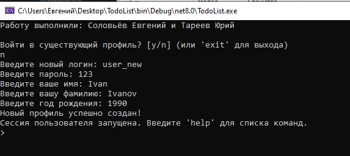

### TC-02 Ошибка создания (занятый логин)
**Описание:** Валидация уникальности логина.
**Предусловия:** Пользователь `user_new` создан в TC-01. Приложение перезапущено.
**Последовательность действий:**
1. Выбрать `n` (создать).
2. Ввести логин: `user_new`.
**Ожидаемый результат:**
- Сообщение "Этот логин уже занят или некорректен.".
**Скриншоты:**
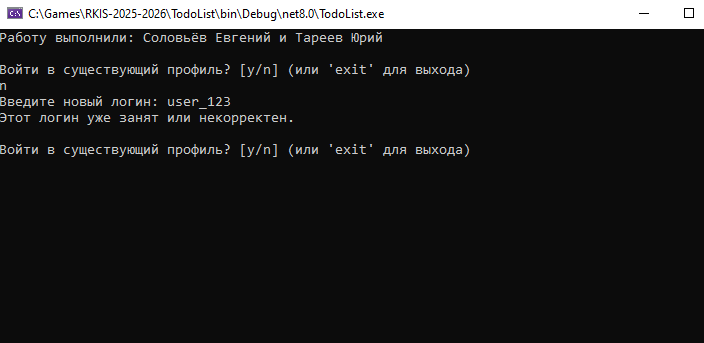

### TC-03 Авторизация и выход
**Описание:** Вход под существующим пользователем и выход из системы.
**Предусловия:** Приложение запущено.
**Последовательность действий:**
1. Выбрать `y`.
2. Логин: `user_new`, Пароль: `123`.
3. Ввести команду `profile --out` (или `exit`, если используется для выхода в меню).
**Ожидаемый результат:**
- При входе: "Добро пожаловать, Ivan!".
- При выходе: Сообщение о выходе, возврат к выбору логина или завершение работы.
**Скриншоты:**
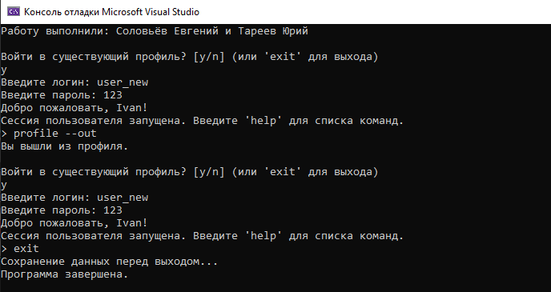

### TC-04 Ошибка авторизации
**Описание:** Ввод неверного пароля.
**Предусловия:** Приложение запущено.
**Последовательность действий:**
1. Выбрать `y`.
2. Логин: `user_new`, Пароль: `0000`.
**Ожидаемый результат:**
- Сообщение "Неверный логин или пароль.".
**Скриншоты:**
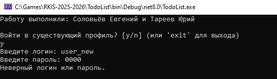

### TC-05 Отображение данных профиля
**Описание:** Проверка корректности загруженных данных пользователя.
**Предусловия:** Авторизация выполнена.
**Последовательность действий:**
1. Ввести команду `profile`.
**Ожидаемый результат:**
- Вывод: Ivan Ivanov, возраст (текущий год - 1990), Логин: user_new.
**Скриншоты:**
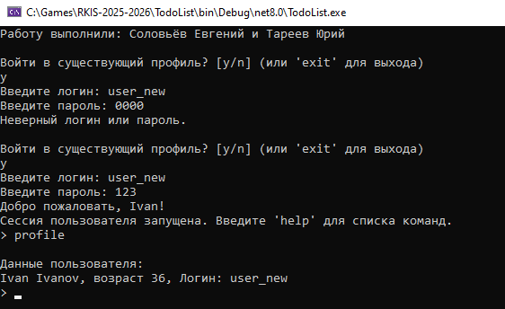

---

## 2. Добавление задач (Add)

### TC-06 Добавление корректной задачи
**Описание:** Стандартное добавление.
**Предусловия:** Пользователь авторизован.
**Последовательность действий:**
1. `add Купить хлеб`.
**Ожидаемый результат:**
- "Задача добавлена!".
**Скриншоты:**
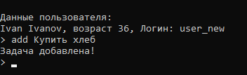

### TC-07 Добавление пустой задачи
**Описание:** Валидация пустого ввода.
**Предусловия:** Пользователь авторизован.
**Последовательность действий:**
1. `add`.
**Ожидаемый результат:**
- Ошибка: "Укажите задачу".
**Скриншоты:**
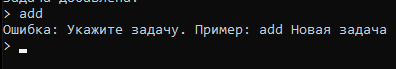

### TC-08 Добавление задачи с длинным текстом
**Описание:** Проверка обработки длинных строк.
**Предусловия:** Пользователь авторизован.
**Последовательность действий:**
1. `add Очень длинная задача которая должна быть обрезана при обычном просмотре списка задач`.
**Ожидаемый результат:**
- Задача успешно добавлена.
**Скриншоты:**
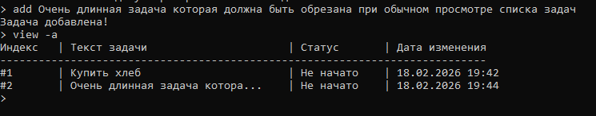

### TC-09 Добавление многострочной задачи
**Описание:** Флаг `--multiline`.
**Предусловия:** Пользователь авторизован.
**Последовательность действий:**
1. `add --multiline`.
2. Ввести: `Строка 1`.
3. Ввести: `Строка 2`.
4. Ввести: `!end`.
**Ожидаемый результат:**
- Задача сохранена с переносами строк.
**Скриншоты:**
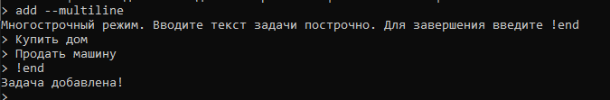

### TC-10 Задачи со служебными символами
**Описание:** Проверка CSV-конфликтных символов.
**Предусловия:** Пользователь авторизован.
**Последовательность действий:**
1. `add Задача с "кавычками"; и точкой с запятой`.
**Ожидаемый результат:**
- Успешное добавление без ошибок.
**Скриншоты:**
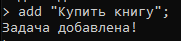

---

## 3. Просмотр задач (View / Read)

### TC-11 Просмотр списка и длинных задач
**Описание:** Проверка отображения списка (`view`).
**Предусловия:** Выполнены тесты TC-06, TC-08.
**Последовательность действий:**
1. `view`.
**Ожидаемый результат:**
- Вывод списка.
- Длинная задача (из TC-08) обрезана троеточием "...".
**Скриншоты:**
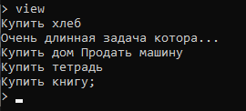

### TC-12 Просмотр с флагами (index, status, date)
**Описание:** Расширенный просмотр.
**Предусловия:** Есть задачи.
**Последовательность действий:**
1. `view --index --status --update-date`.
**Ожидаемый результат:**
- Таблица содержит колонки: Индекс, Текст, Статус, Дата.
**Скриншоты:**
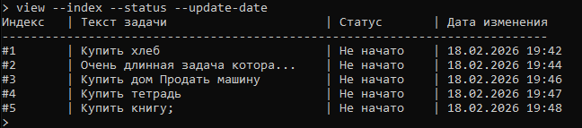

### TC-13 Просмотр полной информации (Read)
**Описание:** Просмотр многострочной задачи и полного текста.
**Предусловия:** Есть многострочная задача (индекс уточнить командой view).
**Последовательность действий:**
1. `read <индекс_многострочной_задачи>`.
**Ожидаемый результат:**
- Выводится полный текст с переносами строк.
**Скриншоты:**
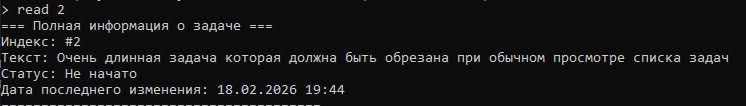

### TC-14 Просмотр пустого списка
**Описание:** Поведение при отсутствии задач.
**Предусловия:** Создать нового пользователя или удалить все задачи.
**Последовательность действий:**
1. `view`.
**Ожидаемый результат:**
- Сообщение "Список задач пуст".
**Скриншоты:**
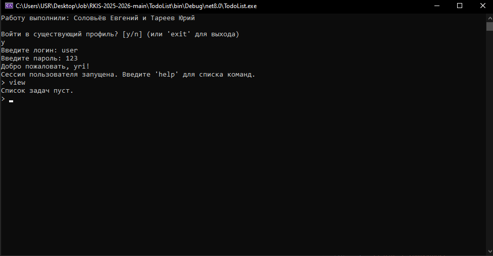

---

## 4. Обновление и Удаление

### TC-15 Обновление текста и статуса
**Описание:** Изменение существующей задачи.
**Предусловия:** Есть задача с индексом 1.
**Последовательность действий:**
1. `update 1 "Обновленный текст"`.
2. `status 1 InProgress`.
3. `view --status`.
**Ожидаемый результат:**
- Текст изменился.
- Статус изменился на InProgress.
**Скриншоты:**
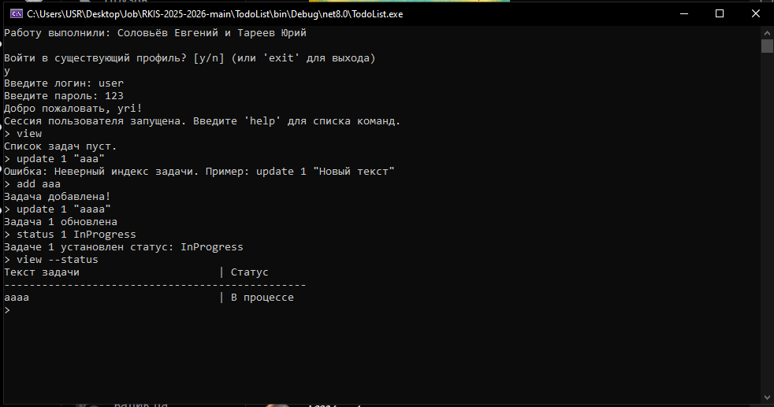

### TC-16 Попытка обновления несуществующей задачи
**Описание:** Обработка неверного индекса.
**Предусловия:** В списке 3 задачи.
**Последовательность действий:**
1. `update 100 "Текст"`.
**Ожидаемый результат:**
- Сообщение об ошибке (Неверный индекс).
**Скриншоты:**
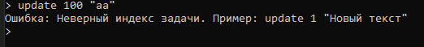

### TC-17 Удаление задачи
**Описание:** Удаление по индексу.
**Предусловия:** Есть задача с индексом 1.
**Последовательность действий:**
1. `delete 1`.
2. `view`.
**Ожидаемый результат:**
- Задачи нет в списке. Индексы сместились.
**Скриншоты:**
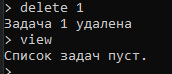

### TC-18 Удаление несуществующей задачи
**Описание:** Ошибка удаления.
**Предусловия:** Индекс вне диапазона.
**Последовательность действий:**
1. `delete 999`.
**Ожидаемый результат:**
- Сообщение об ошибке.
**Скриншоты:**
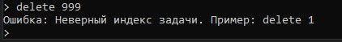

---

## 5. Поиск (Search)

### TC-19 Поиск по подстроке и началу
**Описание:** `contains` и `starts-with`.
**Предусловия:** Задача "Купить молоко".
**Последовательность действий:**
1. `search --contains "молоко"`.
2. `search --starts-with "Купить"`.
**Ожидаемый результат:**
- В обоих случаях задача найдена и выведена.
**Скриншоты:**
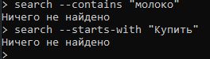

### TC-20 Поиск по дате и статусу
**Описание:** Фильтрация `from/to` и `status`.
**Предусловия:** Есть задачи.
**Последовательность действий:**
1. `search --status InProgress --from 2023-01-01`.
**Ожидаемый результат:**
- Выводятся только задачи со статусом InProgress, измененные после даты.
**Скриншоты:**
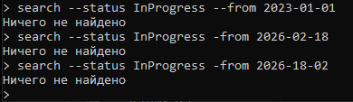

### TC-21 Сортировка и Top N
**Описание:** Проверка `sort`, `desc`, `top`.
**Предусловия:** Минимум 3 задачи.
**Последовательность действий:**
1. `search --sort date --desc --top 2`.
**Ожидаемый результат:**
- Выведено ровно 2 задачи.
- Сортировка от новых к старым.
**Скриншоты:**
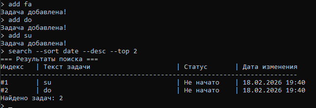

### TC-22 Поиск без совпадений
**Описание:** Поиск несуществующего текста.
**Предусловия:** Любые задачи.
**Последовательность действий:**
1. `search --contains "Абракадабра"`.
**Ожидаемый результат:**
- Сообщение "Ничего не найдено".
**Скриншоты:**
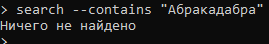

---

## 6. Работа с файлами и Парсинг

### TC-23 Сохранение и загрузка (целостность)
**Описание:** Проверка восстановления данных после перезапуска.
**Предусловия:** Выполнены действия из предыдущих тестов (добавления, статусы).
**Последовательность действий:**
1. `exit` (закрытие программы).
2. Запустить снова.
3. Авторизоваться.
4. `view --index --status`.
**Ожидаемый результат:**
- Все задачи на месте.
- Статусы и тексты совпадают с тем, что было до выхода.
**Скриншоты:**
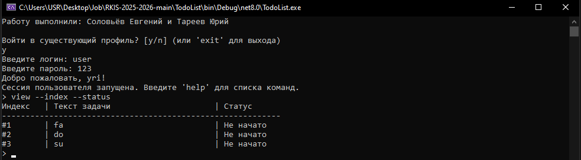

### TC-24 Парсинг спецсимволов
**Описание:** Проверка корректности чтения CSV с кавычками.
**Предусловия:** Была добавлена задача из TC-10.
**Последовательность действий:**
1. `view`.
2. Найти глазами задачу со спецсимволами.
**Ожидаемый результат:**
- Структура файла не нарушена.
- Текст отображается корректно (кавычки и точки с запятой на месте).
**Скриншоты:**
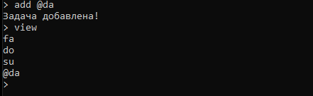

---

## 7. Undo / Redo

### TC-25 Отмена и повтор действий
**Описание:** Проверка стека команд.
**Предусловия:** Список известен.
**Последовательность действий:**
1. `add Тест отмены`.
2. `undo` (задача исчезла).
3. `view` (проверка).
4. `redo` (задача вернулась).
5. `view` (проверка).
**Ожидаемый результат:**
- Undo удаляет добавленную задачу.
- Redo возвращает её обратно.
**Скриншоты:**
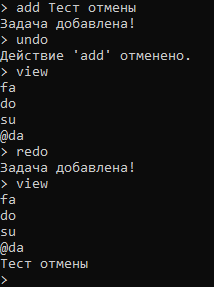